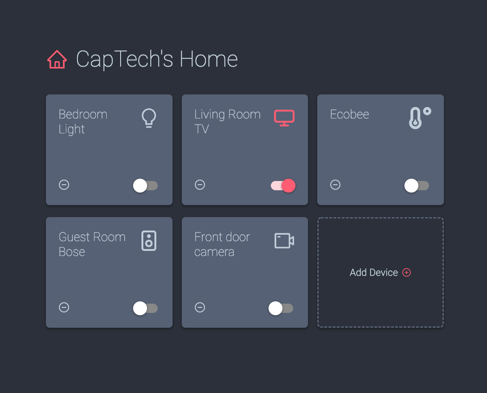

# react-hooks-lab1
Repository for Lab 1 of CapTech's React learning series focused on React Hooks.

## Prerequisites
- Node installed on your machine (v12 or higher)
- Git installed on your machine 

## Setup instructions
1. Clone this repository to your local machine.
2. On your machine, cd into the `start` directory of this project.
3. Once inside the directory, run `npm install`.
4. `rpm run start` will launch the application.

## Introduction


In this lab, we will be building a virtual smart home dashboard using React Hooks. Our dashboard will have the following functionality:
- Display a list of our smart devices
- Add a device
- Delete a device
- Toggle device on/off 

The basic components and styling of the application have already been implemented for you, as we want to jump right into using hooks. 

We will start the lab by implementing local state across the application using the `useState` hook. Then, we will begin loading our home from an API call with `useEffect` when our app initializes. We will also convert the various functions across the application to hit our API, adding loading states along the way. Finally, we will abstract some of the reused logic from each of our API calls into our own custom `useFetch` hook. 

## Part 1: Add local state using `useState`
Once you have the application up and running, you'll notice that none of the core functionality is actually working. We will need to add local state to our components to keep track of any changes we make from the UI. 

The first change that we will make to our application will be in `DeviceTile.js`. Currently, clicking the toggle switch on the device doesn't change anything. We want the color of the icon in the top corner of our tile to reflect the state of our device. Let's use the `useState` hook to accomplish this.

```
import { useState } from "react";

function DeviceTile({device, onDelete}) {
  const [active, setActive] = useState(device.state === "ON")
  ...
 }
```
Now, we can reference our DeviceTile's on/off state (initialized based on the component's props) with the `active` variable, and we can update our state using the `setActive` method. Update the `render` method to reference our new `active` state anywhere we were previously using `device.state === "ON"`.

Next, we'll need to call our `setActive` method when our SwitchWrapper component changes. We can do this by updating the `toggleState` method that has already been defined at the top of the component.

```
const toggleState = (change) => setActive(change);
```
If everything is working properly, our toggle switch should now corrently update the DeviceTile's state!
